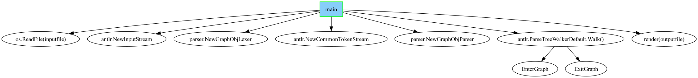

# graphobj

Define graph like Pseudo Functions.

## Example

the following Pseudo Function describes the implementation of `main()` in `main.go`.

```
main [shape=box, color="#00FF00", style=filled, fillcolor="#87CEFA"]
{
    os.ReadFile(inputfile){}

    antlr.NewInputStream{}
    parser.NewGraphObjLexer{}
    antlr.NewCommonTokenStream{}
    parser.NewGraphObjParser{}

    antlr.ParseTreeWalkerDefault.Walk(){
        EnterGraph{}
        ExitGraph{}
    }

    render(outputfile)
}
```

the `main` node attached `dot` [Node Attributes](https://graphviz.org/docs/nodes/):
`main [shape=box, color="#00FF00", style=filled, fillcolor="#87CEFA"]`


