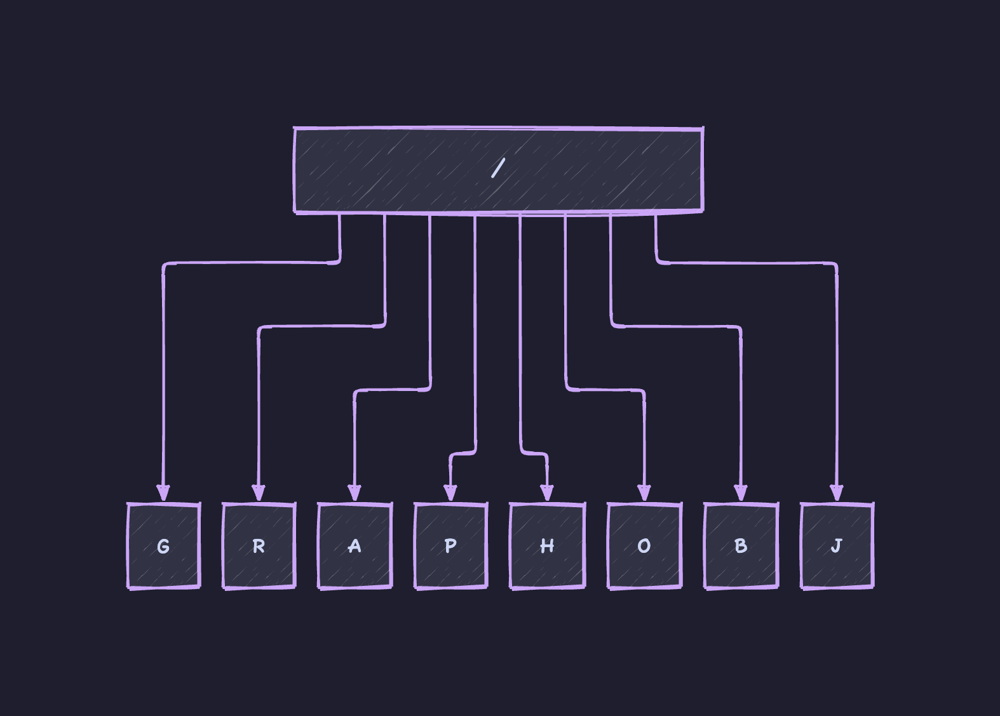
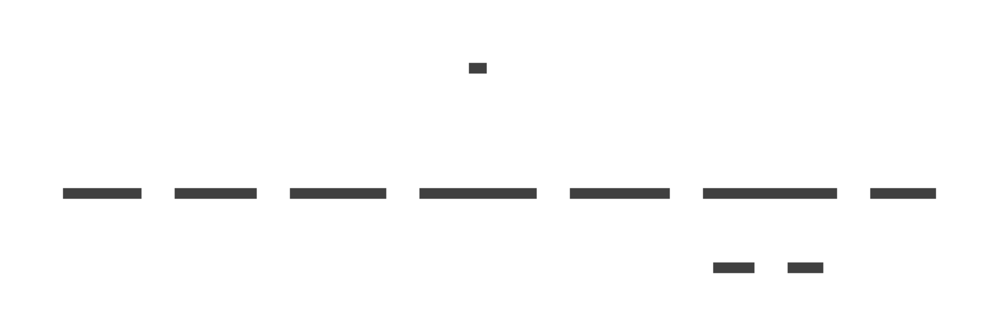

# graphobj



Define Graph like Pseudo Functions. Then draw it using [D2](https://d2lang.com/).

## Install

```
// D2
curl -fsSL https://d2lang.com/install.sh | sh -s --

// antlr
brew install antlr

// graphobj
go install github.com/longqimin/graphobj
```

## Usage

### define Graph Objects like pseudo functions

`main.d2.obj` describes the implementation of `main()` in `graphobj/main.go` as following:

```
main {
    os.ReadFile(inputfile){}

    antlr.NewInputStream{}
    parser.NewGraphObjLexer{}
    antlr.NewCommonTokenStream{}
    parser.NewGraphObjParser{}

    antlr.ParseTreeWalkerDefault.Walk(){
        EnterGraph{}
        ExitGraph{}
    }

    render(outputfile){}
}
```

### draw the graph

```
graphobj main.d2.obj -o main.svg
```

output `main.svg`:

